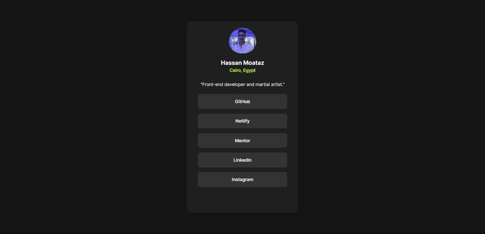
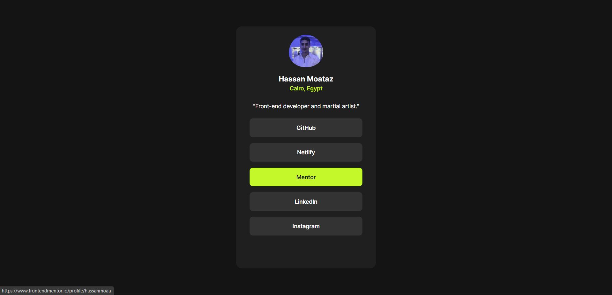
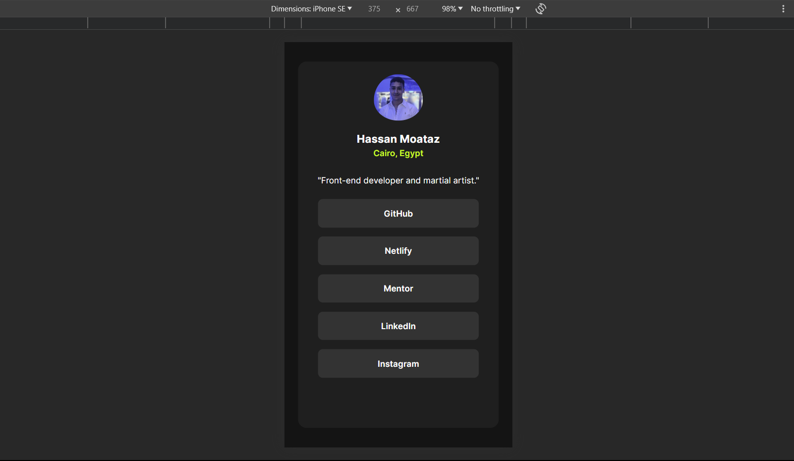

# Frontend Mentor - Social links profile solution

This is a solution to the [Social links profile challenge on Frontend Mentor](https://www.frontendmentor.io/challenges/social-links-profile-UG32l9m6dQ). Frontend Mentor challenges help you improve your coding skills by building realistic projects. 

## Table of contents

- [Overview](#overview)
  - [The challenge](#the-challenge)
  - [Screenshot](#screenshot)
  - [Links](#links)
- [My process](#my-process)
  - [Built with](#built-with)
  - [What I learned](#what-i-learned)
  - [Continued development](#continued-development)
  - [Useful resources](#useful-resources)
- [Author](#author)

## Overview

### The challenge

Users should be able to:

- See hover and focus states for all interactive elements on the page

### Screenshot

### Links

- Solution URL: (https://github.com/hassanmoaa/social-links-profile-FrontEndMentor.git)
- Live Site URL: (https://inspiring-nasturtium-3bd06b.netlify.app/)

### Built with

- Semantic HTML5 markup
- CSS custom properties
- Flexbox
- Grid
- Google Fonts

### What I learned

This challenge been easy for me as i'm getting stronger with it.

Also its the first time using media-queries in here!

It gived me motivation to pursue more Front-end challenges as it sharpens my skills while doing it!!

- /*card-design*/
.card {
    background-color: var(--dark-grey__card-background);
    width: min(88%, 25rem);
    margin: 8rem auto;
    height: 100%;
    padding: 1.5rem;
    color: var(--white);
    border-radius: 1rem;
}

/*media-queries for mobiles*/
@media screen and (max-height: 450px) {
    .card {
        height: 62%;
    }
}

### Continued development

- I want to learn more about css by creating responsive multi-page websites.

### Useful resources

-(https://www.w3schools.com) - W3S helped me using media-queries.

## Author

- Frontend Mentor - [@hassanmoaa](https://www.frontendmentor.io/profile/hassanmoaa)
